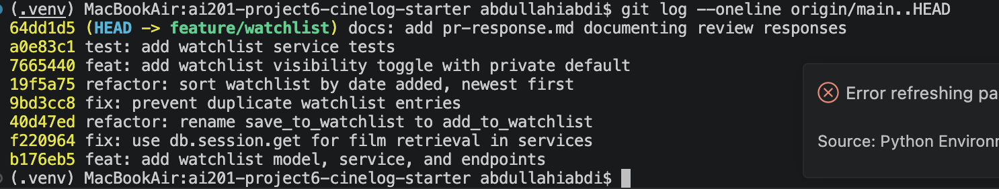

# PR Response Doc — CineLog Watchlist Feature

## AI Usage
<!-- REVIEW AND EDIT THIS so it honestly reflects how *you* used AI. -->
- **Orientation:** used AI to summarize `models.py`, `collection_service.py`, and
  `test_collection.py` and to explain how `add_to_collection()`'s deduplication check
  works, so I could mirror the existing pattern instead of inventing a new one.
- **Design decisions (Comments 4 & 5):** the positions are mine — private-by-default and
  date-added sorting. I used AI as a devil's advocate: after drafting each argument I
  asked "what's the strongest counterargument a reviewer would raise?" For Comment 4 it
  surfaced the discovery/social cost of a private default, which I added to the tradeoff
  section. For Comment 5 it pressed the "old entries get buried" objection, which I
  addressed directly by proposing a future `sort` param rather than defaulting to
  alphabetical.
- **Rebase:** used AI to inspect the UUID refactor diff and confirm my conflict
  resolution (UUID `film_id`) was consistent with `CollectionEntry`.

## Comment 1 — Rename
**What I did:** Renamed `save_to_watchlist()` to `add_to_watchlist()` in
`services/watchlist_service.py` to match the project's `verb_to_noun` convention
(`add_to_collection`, `remove_from_collection`, `get_collection`) documented in
CONTRIBUTING.md.
**Finding all call sites:** Ran a project-wide `grep -rn "save_to_watchlist" --include=*.py`
(excluding `.venv`). It surfaced exactly two references, both in
`routes/watchlist/watchlist.py` — the import on line 8 and the call inside
`add_film()` on line 32. Updated both.
**How I verified:** Re-ran the grep after editing — zero remaining references to the
old name. `pytest tests/ -v` stayed green (4 passing at that point).

## Comment 2 — Deduplication
**What I did:** Followed the `add_to_collection()` pattern in
`services/collection_service.py`. Added an `AlreadyOnWatchlistError` exception and,
in `add_to_watchlist()`, a `WatchlistEntry.query.filter_by(user_id, film_id).first()`
check that raises before inserting — same order as collection: film-exists check
first, duplicate check second, insert last. I also added a
`UniqueConstraint("user_id", "film_id")` to `WatchlistEntry` in `models.py`, mirroring
`CollectionEntry`, so the invariant is enforced at the DB level too, not just in
application code.
**How I verified:** `add_to_collection()` raises `AlreadyInCollectionError` on the
second call and leaves exactly one row; my `test_add_to_watchlist_duplicate_raises`
asserts the same for the watchlist (raises + count == 1). All tests pass.

## Comment 3 — Missing test
**What I did:** Created `tests/test_watchlist.py`. Modeled it on
`tests/test_collection.py` — copied the `app`, `sample_user`, and `sample_film`
fixtures and used `test_add_to_collection_nonexistent_film_raises` as the direct
template for `test_add_to_watchlist_nonexistent_film_raises` (a nonexistent film id
should raise `FilmNotFoundError`). I also added the happy-path and duplicate tests so
the file covers CONTRIBUTING.md's three-test requirement for a new service function.
**How I verified:** `pytest tests/test_watchlist.py -v` → 3 passing;
`pytest tests/ -v` → 7 passing (4 collection + 3 watchlist).

## Comment 4 — Default visibility
**My position:** Watchlist entries should default to **private** (`public=False`). I
changed the `WatchlistEntry.public` column default from `True` to `False` and added an
explicit `public` parameter to `add_to_watchlist()` (and the `/add` route) so callers
opt *into* visibility rather than out of it.

**Reasoning (grounded in CineLog's model):** Two facts about this codebase drove the
decision. First, `CollectionEntry` — the record of films a user has *already watched* —
has no visibility field at all; it's implicitly personal. If the watchlist defaulted to
public, a user's *aspirational* list ("films I intend to watch") would be more exposed
than their actual viewing history, which is an inconsistent and surprising privacy
posture. A "want to watch" list can be at least as revealing as what you've seen — it
signals intent, mood, and interests you may not have acted on yet. Second, the current
API has **no authentication or ownership check**: `GET /watchlist/<user_id>` serves
whatever the entries' `public` flag allows for any user_id in the URL. With a public
default, adding a film silently publishes it to anyone who can guess or enumerate a
user_id. Private-by-default makes exposure a deliberate act and keeps the blast radius
small until real auth exists.

**Tradeoff acknowledged:** The maintainer's community/discovery goal is real — a film app
gains value when lists are browsable, and a private default means new entries contribute
nothing to discovery unless the user takes an extra step, so social features will see
lower opt-in. I accept that cost because the reverse failure (silently over-sharing under
a no-auth API) is harder to undo than under-sharing. The explicit `public` toggle keeps
the discovery path fully open for users who want it — sharing is one field away, it's
just no longer the default.

## Comment 5 — Sort order
**My position:** I **agree with the maintainer** and switched `get_watchlist()` from
alphabetical (`Film.title.asc()`) to date-added, newest-first
(`WatchlistEntry.date_added.desc()`).

**Reasoning:** Two reasons beyond "recent is nice." (1) **Consistency:**
`get_collection()` already sorts `date_added.desc()`. Having the two list features share
one ordering model means a user (and a future contributor) learns the behavior once
instead of memorizing that collection is chronological but watchlist is alphabetical.
(2) **Alignment with intent:** a watchlist is a queue of intent, not a reference index.
The film I added last is the one most top-of-mind — I just heard about it and want to
watch it soon. Alphabetical order is arbitrary relative to that intent: "Amélie"
outranking "Zodiac" carries no signal about what I actually want to watch next, whereas
recency does.

**Engagement with reviewer's point:** The maintainer said "most users want to see what
they added recently," and I think that's right for this data type. The strongest
counterargument for alphabetical (which I considered and rejected) is that newest-first
**buries older entries** at the bottom of a list with no natural size limit — a film I
added a year ago and still mean to watch sinks out of view. I acknowledge that, but the
fix for "I can't find an old entry" is search/filter or an optional `sort` parameter, not
defaulting the whole list to title order — which would bury *recent intent* behind
arbitrary alphabetization for every user on every view. If findability of old entries
becomes a real complaint, the right follow-up is a `sort` query param (defaulting to
date-added), not flipping the default.

## Comment 6 — Rebase
**What conflicted:** Two files during `git rebase origin/main`:
1. `.gitignore` (add/add) — `main` had merged its own `.gitignore` (PR #2), and my
   branch added one too.
2. `models.py` (content) — `main` migrated `Film.id` and `CollectionEntry.film_id` from
   `Integer` to `String(36)` UUID and rewrote the file's header; my branch had added
   `WatchlistEntry` with an **integer** `film_id`. During replay, the messy original
   "added watchlist model" commit lost its `WatchlistEntry` block against main's rewritten
   file, so the block came back in on my dedup commit — which is where the conflict
   surfaced.

**How I resolved it:**
- `.gitignore`: main's version was a strict superset of mine (same entries plus
  `.pytest_cache/`), so my commit was redundant. I ran `git rebase --skip` to drop it
  rather than keep a no-op commit.
- `models.py`: kept main's UUID schema for `Film`/`CollectionEntry` and changed
  `WatchlistEntry.film_id` from `db.Integer` to `db.String(36)` so the foreign key matches
  the migrated `film.id`. I preserved the `UniqueConstraint` from my dedup work.
- Followed up by updating the remaining integer references the reviewer flagged: the
  `add_to_watchlist` docstring (`film_id (int)` → `film_id (str): UUID of the film`) and
  the `/add` route body doc (`<int>` → `<uuid str>`). My nonexistent-film test already
  used a UUID-shaped id, so it needed no change.

**How I verified no conflict remains:**
- `grep -rn "<<<<<<<|>>>>>>>"` across the source → no markers left.
- `pytest tests/ -v` → 8 passing.
- `git log --merges origin/main..HEAD` → empty (no merge commits; history is linear).
- Confirmed `git grep` for `Integer`/`pre-refactor` in the watchlist code returns nothing.

_Note: after resolving the rebase I rewrote the branch history (Milestone 4) into the
conventional commits below. In that clean history the `WatchlistEntry` model is defined
in the initial `feat:` commit and the UUID `film_id` is correct from the start, so the
transient "model landed on the dedup commit" artifact from the raw rebase no longer
exists._

## Commit History (after cleanup)
Rewrote the branch into conventional, one-logical-change-per-commit history with
`git rebase`/history rebuild. `git log --oneline origin/main..HEAD`:

```
docs: add pr-response.md documenting review responses
test: add watchlist service tests
feat: add watchlist visibility toggle with private default
refactor: sort watchlist by date added, newest first
fix: prevent duplicate watchlist entries
refactor: rename save_to_watchlist to add_to_watchlist
fix: use db.session.get for film retrieval in services
feat: add watchlist model, service, and endpoints
```



## PR Description

### What this feature does
Adds a **watchlist** to CineLog so users can save films they intend to watch, kept
separate from their collection (films already watched). It introduces a `WatchlistEntry`
model (UUID-keyed to match the post-refactor schema), an `add_to_watchlist()` /
`get_watchlist()` service, and two endpoints: `GET /watchlist/<user_id>` and
`POST /watchlist/<user_id>/add`. Adding a film that doesn't exist raises
`FilmNotFoundError`; adding one already on the list raises `AlreadyOnWatchlistError`
(enforced both in the service and by a DB unique constraint).

### Design decisions
1. **Default visibility → private (`public=False`).** Because `CollectionEntry` has no
   visibility concept and the API currently has no auth, defaulting watchlists to public
   would silently over-expose a user's intent to anyone who can reach a `user_id`.
   Entries are private by default; callers opt into visibility with `"public": true`.
   (Full reasoning + tradeoff under Comment 4.)
2. **Sort order → date added, newest first.** Agreed with the maintainer over the
   original alphabetical sort: recency matches how users treat a watchlist (a queue of
   intent) and stays consistent with `get_collection()`. (Full reasoning under Comment 5.)

### How to manually test
```bash
python -m venv .venv && source .venv/bin/activate
pip install -r requirements.txt
python app.py   # serves at http://127.0.0.1:5000
```
1. Create a user and two films via the existing endpoints; note their UUIDs.
2. Add a film (defaults to private):
   ```bash
   curl -X POST http://127.0.0.1:5000/watchlist/<user_id>/add \
     -H "Content-Type: application/json" -d '{"film_id": "<film_id>"}'
   ```
   Response is `201` with `"public": false`.
3. Add a second film explicitly public:
   ```bash
   curl -X POST http://127.0.0.1:5000/watchlist/<user_id>/add \
     -H "Content-Type: application/json" -d '{"film_id": "<film_id_2>", "public": true}'
   ```
4. Repeat step 2 with the same `film_id` → expect a duplicate rejection
   (`AlreadyOnWatchlistError`).
5. View the watchlist and confirm newest-added appears first:
   ```bash
   curl http://127.0.0.1:5000/watchlist/<user_id>
   ```
6. Add a nonexistent `film_id` → expect a `FilmNotFoundError`.
7. Run the suite: `pytest tests/ -v` → 8 tests pass (4 collection, 4 watchlist).

### Stretch work included
- **Visibility toggle:** the `public` parameter on `add_to_watchlist()` / the `/add`
  endpoint (see Comment 4).
- **Extra test:** `test_add_to_watchlist_visibility` verifies the private default and the
  explicit `public=True` path — an edge case beyond the requested nonexistent-film test.
